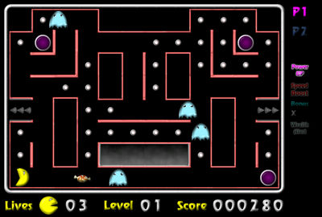



## SnackMan

### Description

This is an older project I wrote - no documentation, but game play is simply enough - the title should sound familiar enough.
 
### More Info
 
Must have DirectX 7 or better. If this interest you, check out the Games & Graphics download, also on this site. It will give indepth instructions on how to design DirectX games.

             |
---                |---
**Submitted On**   |2003-06-27 14:24:02
**By**             |[Tim Harpur](https://github.com/Planet-Source-Code/PSCIndex/blob/master/ByAuthor/tim-harpur.md)
**Level**          |Intermediate
**User Rating**    |5.0 (15 globes from 3 users)
**Compatibility**  |VB 5\.0, VB 6\.0
**Category**       |[Games](https://github.com/Planet-Source-Code/PSCIndex/blob/master/ByCategory/games__1-38.md)
**World**          |[Visual Basic](https://github.com/Planet-Source-Code/PSCIndex/blob/master/ByWorld/visual-basic.md)
**Archive File**   |[SnackMan1618577212003\.zip](https://github.com/Planet-Source-Code/tim-harpur-snackman__1-47093/archive/master.zip)

### API Declarations

Must have DirectX 7+ installed. This project uses a reference to the Visual Basic DirectX 7 Type library.

